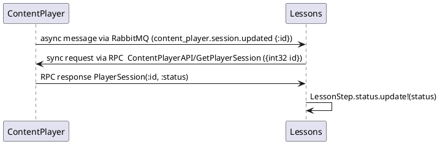

# system-uml

```puml
@startuml
ContentPlayer -> Lessons : async message via RabbitMQ (content_player.session.updated {:id})
Lessons -> ContentPlayer : sync request via RPC  ContentPlayerAPI/GetPlayerSession ({int32 id})
ContentPlayer -> Lessons : RPC response PlayerSession(:id, :status)
Lessons -> Lessons : LessonStep.status.update!(status)
@enduml
```
