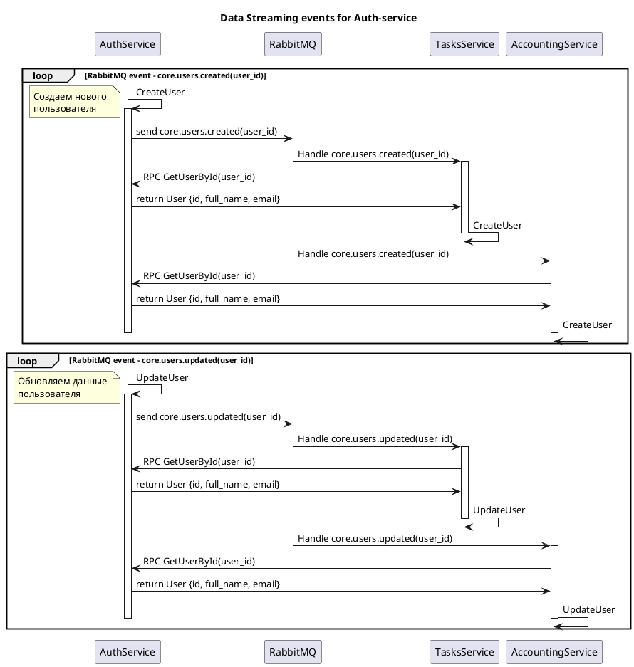

## UML based on plantuml
[http://www.plantuml.com/plantuml/uml](http://www.plantuml.com/plantuml/uml/)

### AuthService events


### TasksService events
```puml
title Data Streaming events for Tasks-service
loop RabbitMQ event - core.tasks.created(task_id)

TasksService -> TasksService : CreateTask

note left
Добавляем новый
таск
end note

activate TasksService
TasksService -> RabbitMQ : send core.tasks.created(task_id)

RabbitMQ -> AccountingService : Handle core.tasks.created(task_id)

activate AccountingService
AccountingService -> TasksService : RPC GetTaskById(task_id)
TasksService -> AccountingService : return Task {id, name, status}
AccountingService -> AccountingService : CreateTask
AccountingService -> AccountingService : CreateTaskCost
deactivate AccountingService

deactivate TasksService
end
```